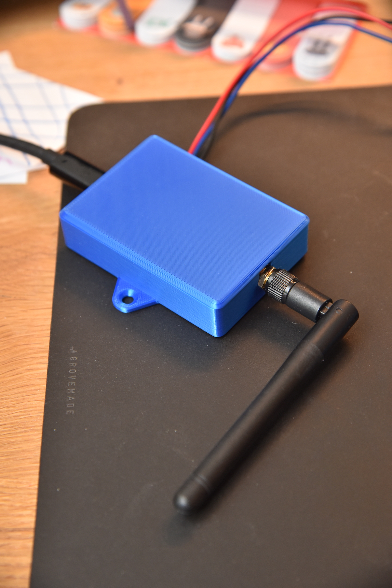
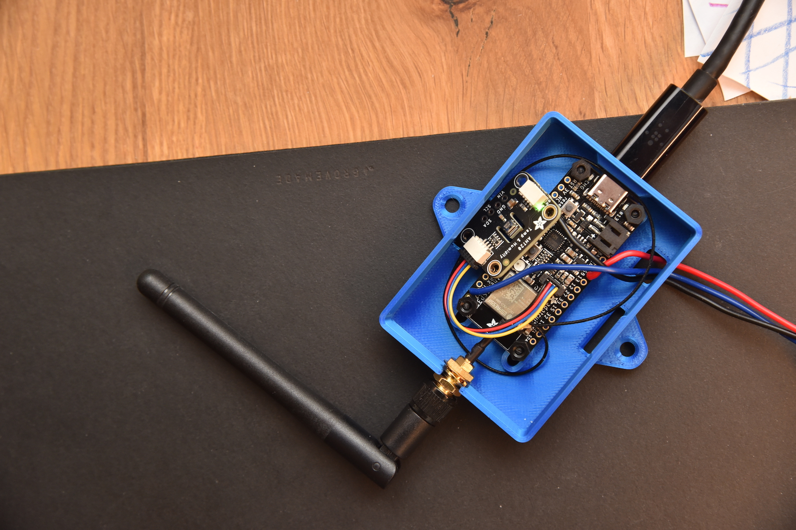
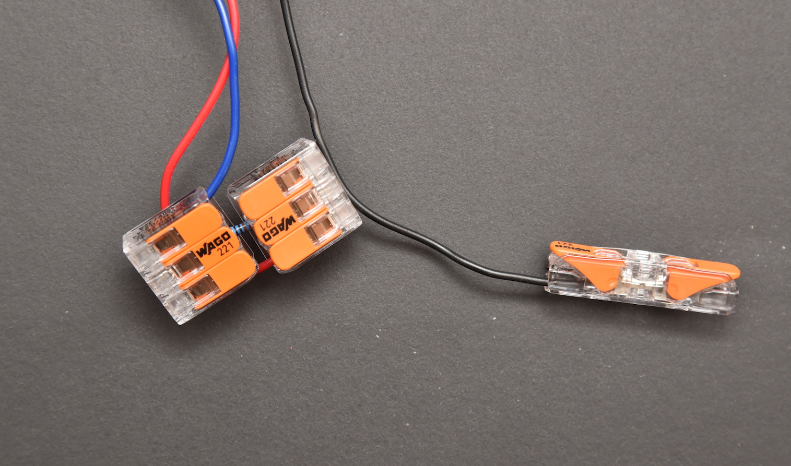
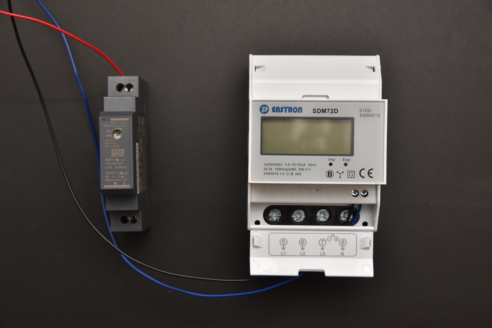
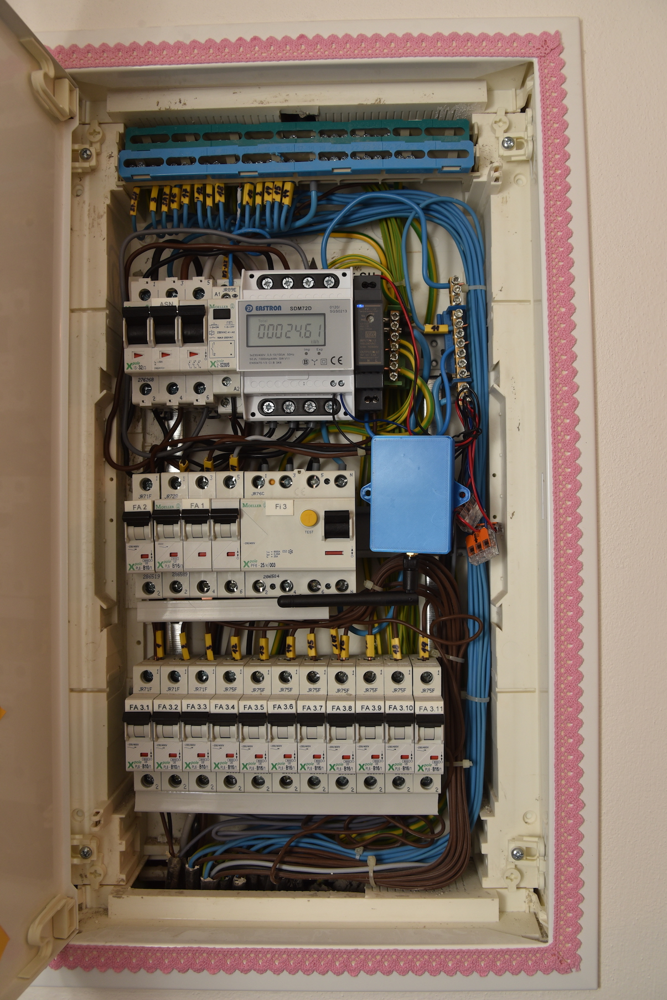
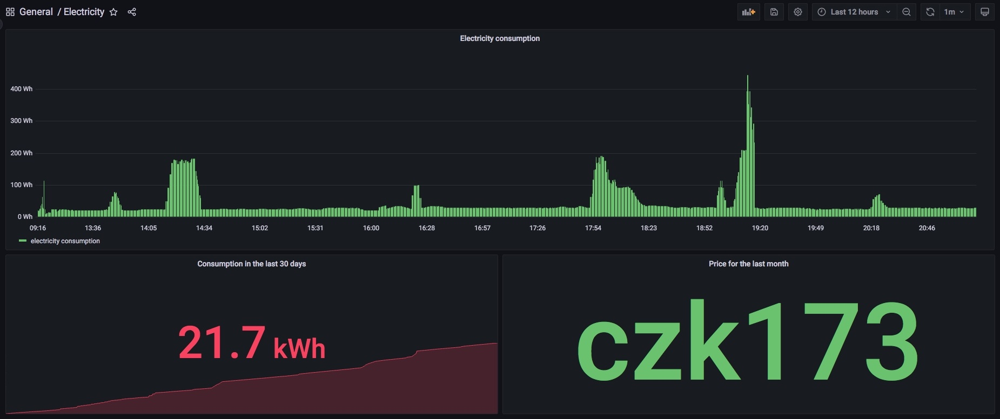

[](https://github.com/vladak/fusebox/actions/workflows/python-checks.yml)

# Fusebox - power consumption monitoring

This repository contains code for ESP32 V2 Adafruit Feather to measure temperature and send it to MQTT broker via WiFi.
The Feather is located in a fuse box, running from a 5V power. It reads pulses from a wire connected to a power meter.

This is somewhat similar to the [shield](https://github.com/vladak/shield) project.
Likewise, I used this project as a way to learn more about electronic circuitry,
[CircuitPython](https://circuitpython.org/), MQTT, microcontrollers, etc. and 
I mostly enjoyed the process of building it.

## Hardware

Here is a bill of materials:

Purpose | Name
---|---
microcontroller | [ESP32 Feather V2 with w.FL antenna connector](https://www.adafruit.com/product/5438)
antenna | [RP-SMA: 2 dBi](https://botland.cz/usb-wifi-karty/4750-wifi-usb-n-600mbps-sitova-karta-s-antenou-5907621809676.html)
pigtail | [RP-SMA to w.FL / MHF3 / IPEX3 Adapter](https://www.adafruit.com/product/5444)
temperature/humidity sensor | [Adafruit AHT20 - Temperature & Humidity Sensor Breakout Board - STEMMA QT / Qwiic](https://www.adafruit.com/product/4566)
power meter | [SDM 72D 0,25-100A MID](https://www.elektromery.com/product/trifazove-elektromery-na-listu-din-neove/elektromer-sdm-72d--0_25-100a-mid/177)
5V power supply | [Meanwell HDR-15-5](https://www.meanwell.com/webapp/product/search.aspx?prod=HDR-15)
Wago connectors | 3 x [221-413](https://www.wago.com/global/installation-terminal-blocks-and-connectors/compact-splicing-connector/p/221-413)
enclosure | [3D Printed Case for Adafruit Feather](https://learn.adafruit.com/3d-printed-case-for-adafruit-feather/parts) - solid lid, bottom with wings
mounts | [nylon screw and stand-off set](https://www.adafruit.com/product/3299)

Most of the stuff comes from [Adafruit](https://www.adafruit.com/).

## Genesis

In the midst of the [energy crisis](https://en.wikipedia.org/wiki/2021%E2%80%932022_global_energy_crisis),
I wondered what the power consumption of our household looks like in detail,
esp. with running a small [home lab](https://www.reddit.com/r/homelab/).

I came across a web that completed [just that](https://www.berlinger.cz/blog/mereni-elektriny/) using Arduino.
Being a fan of Adafruit and CircuitPython, I wanted to replicate this with these.

### ESP32 V2 and WiFi

Testing with [ESP32-S2](https://www.adafruit.com/product/5303) that has built-in antenna placed inside the fuse box,
revealed once again that there is some problem in the stack as some of the
MQTT messages sent from the Feather to the MQTT broker are lost.

From the last Adafruit order, I had the antenna pigtail, and I found a USB WiFi adapter
that came with small 2 dBi antenna. Since the WiFi adapter cost like 5 EUR,
I used the antenna and trashed the USB dongle (of course, I recycled it properly
with other electronic waste I had).

### Temperature/humidity monitoring

Initially, to test the code that was still heavily based on the [shield](https://github.com/vladak/shield) code,
I connected temperature/humidity sensor to have some data sent out.

Then I figured why not to leave the sensor in place. There will not be many variations
inside the fuse box, however it might be interesting to see the values in the long term.

### Physical packaging

To place the microcontroller inside the fuse box securely, I needed a box.
Since the local manufacturer of 3D printers has a [map](https://world.prusa3d.com)
with places where it is possible to have the models printed, it was quite easy.
I found a school in walkable distance that has a workshop with more than 10 printers,
called the teacher responsible for the workshop, and I had the box ready in 2 days for cheap.



To fasten the microcontroller inside the case, I used the [nylon screw and stand-off set](https://www.adafruit.com/product/3299).
I am glad that I ordered the screw set without having a firm plan what to use it for.

The nice thing about the case is that the Neopixel blinking (in blue, for half a second),
which happens whenever a message is published to MQTT broker,
is visible through the lid of the enclosure (also blue color) as it is a bit translucent.

### Wiring

The color coding I choose is based on the [STEMMA QT spec](https://learn.adafruit.com/introducing-adafruit-stemma-qt/technical-specs) -
red for V+ power, black for ground. The pulse wire is blue (matching the color 
of the box for a bonus !).



To get reliable pulse readings, a [pullup resistor](https://en.wikipedia.org/wiki/Pull-up_resistor) is needed.
In order to connect all the wires and the resistor together I used the Wago connectors.
I cut the leads to the resistor a bit so it almost completely hides inside the Wago connectors.
The only soldering necessary was for the 3 wires attached to the Feather.



The only struggle I had was powering the Feather. It turned out that both +V and -V outputs from the
power supply have to be used. The +V connected to the USB input/output and -V connected to GND.
Thus, the -V is connected to the Wago connector together with the GND from Feather and the '-' impluse contact
from the power meter.



And here is the final result:




### Code

The code is simple - in endless cycle it collects and sends the pulse count (and sensor data)
to MQTT broker. Since it has to count the pulses, it would be undesirable to enter any kind
of hardware sleep that would prevent that. It is also not needed, given the microcontroller is connected to 5V
power supply inside the fuse box.

## Software/firmware install

Firstly, the microcontroller needs to be converted to run CircuitPython. To do that, for ESP32 V2, I chose the [command line `esptool`](https://learn.adafruit.com/circuitpython-with-esp32-quick-start/command-line-esptool) on a Linux computer (since macOS appeared to have flaky serial connection for some reason). For ESP32-S2 this procedure is simpler.

Once CicuitPython is installed, the following could be used:
- copy `*.py` to the `CIRCUITPY` volume
- copy all necessary libraries from Adafruit CircuitPython bundle to `CIRCUITPY/lib` directory 

Since switching to ESP32 V2, web based workflow has to be used, which means the process of
copying the Python files and Adafruit CircuitPython bundle libraries has to be done by hand,
using the web uploader, [until `circup` supports the web based workflow](https://github.com/adafruit/circup/issues/156).

The web workflow for this case is actually a boon, since going into the fusebox cabinet
in order to change the code would be undesirable and potentially dangerous.

Having static IP address for the microcontroller is handy.

## Configuration

The number of pulses is stored in a [counter](https://prometheus.io/docs/concepts/metric_types/#counter) in Prometheus.

### Prometheus MQTT exporter

The contents of `/etc/prometheus/mqtt-exporter.yaml` should look like this:

```yml
mqtt:
  # The MQTT broker to connect to
  server: tcp://localhost:1883
  # The Topic path to subscribe to. Be aware that you have to specify the wildcard.
  topic_path: devices/#
  # Optional: Regular expression to extract the device ID from the topic path. The default regular expression, assumes
  # that the last "element" of the topic_path is the device id.
  # The regular expression must contain a named capture group with the name deviceid
  # For example the expression for tasamota based sensors is "tele/(?P<deviceid>.*)/.*"
  device_id_regex: "(.*/)?(?P<deviceid>.*)"
  # The MQTT QoS level
  qos: 0
cache:
  # Timeout. Each received metric will be presented for this time if no update is send via MQTT.
  # Set the timeout to -1 to disable the deletion of metrics from the cache. The exporter presents the ingest timestamp
  # to prometheus.
  timeout: 60m
# This is a list of valid metrics. Only metrics listed here will be exported
metrics:
  -
    # The name of the metric in prometheus
    prom_name: temperature
    # The name of the metric in a MQTT JSON message
    mqtt_name: temperature
    # The prometheus help text for this metric
    help: temperature reading
    # The prometheus type for this metric. Valid values are: "gauge" and "counter"
    type: gauge
  -
    # The name of the metric in prometheus
    prom_name: humidity
    # The name of the metric in a MQTT JSON message
    mqtt_name: humidity
    # The prometheus help text for this metric
    help: humidity reading
    # The prometheus type for this metric. Valid values are: "gauge" and "counter"
    type: gauge
    # A map of string to string for constant labels. This labels will be attached to every prometheus metric
    #const_labels:
    #  sensor_type: dht22
  -
    # The name of the metric in prometheus
    prom_name: pulses
    # The name of the metric in a MQTT JSON message
    mqtt_name: pulses
    help: Pulse count
    # The prometheus type for this metric. Valid values are: "gauge" and "counter"
    type: counter
```

### Prometheus

The MQTT exporter by itself sets the `sensor` tag to the last component of the topic,
which in this case is the device name. To get also the location (2nd component of the topic), 
re-labeling in Prometheus itself is used.

Under the `scrape_configs` section in `/etc/prometheus/prometheus.yml` there should be:
```yml

  - job_name: mqtt
    # If prometheus-mqtt-exporter is installed, grab metrics from external sensors.
    static_configs:
      - targets: ['localhost:9641']
    # The MQTT based sensor publish the data only now and then.
    scrape_interval: 5m
    # Add the location as a tag.
    metric_relabel_configs:
     - source_labels: [topic]
       target_label: location
       regex: 'devices/([[:alnum:]]*)/[[:alnum:]]*'
       action: replace
       replacement: "$1"

```

## Grafana

The dashboard is rather simple:



It captures only the first day of measurement, so the per month values are not real yet.

The dashboard can be downloaded from [Electricity.json](/Electricity.json).

## Usage

There needs to be a `secrets.py` file that contains Wi-Fi credentials and information about the MQTT broker.
It can look like this:
```python
# This file is where you keep secret settings, passwords, and tokens!
# If you put them in the code you risk committing that info or sharing it

secrets = {
    "ssid": "foo",
    "password": "bar",
    "broker": "172.40.0.3",
    "broker_port": 1883,
    "mqtt_topic": "devices/fusebox/esp32",
    "sleep_duration": 30,
    "log_level": "INFO",
}
```

To transfer the file to the microcontroller, the same method as in the Install section should be used.

## Guide links

Adafruit has largely such a good documentation that the links are worth putting here for quick reference:
- CircuitPython [countio](https://docs.circuitpython.org/en/latest/shared-bindings/countio/index.html)
- [ATH20 guide](https://learn.adafruit.com/adafruit-aht20)

## Future

After completing the project, I found there are many sophisticated setups out there that
allow electricity consumption monitoring for individual rooms, basically per breaker.
These are usually done by having multiple power meters and/or dedicated gadgets that have multiple
sensors placed on individual phase wires in the fuse box.

Rether than going this way, further cluttering the fuse box, I might use electricity consumption
readings from various smart plugs around the house that are already connected to the IoT network.
